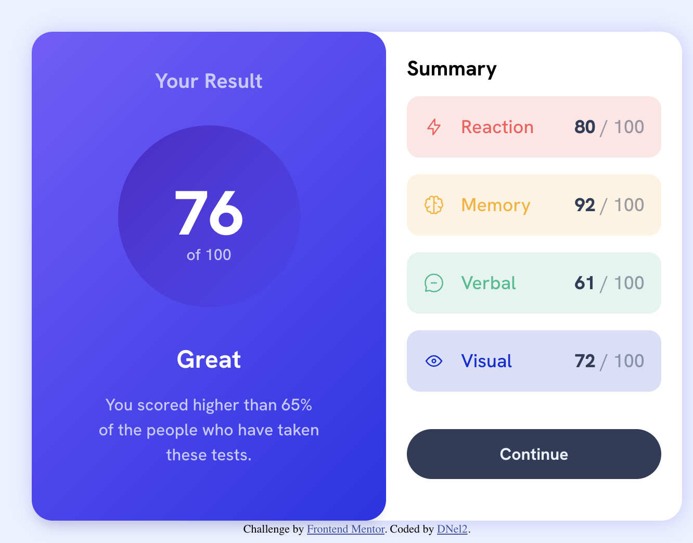
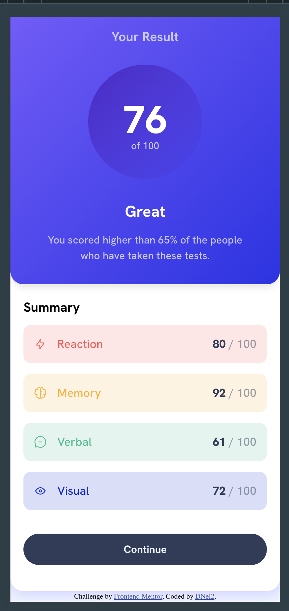

# Frontend Mentor - Results summary component solution

This is a solution to the [Results summary component challenge on Frontend Mentor](https://www.frontendmentor.io/challenges/results-summary-component-CE_K6s0maV). Frontend Mentor challenges help you improve your coding skills by building realistic projects. 

## Table of contents

- [Overview](#overview)
  - [The challenge](#the-challenge)
  - [Screenshot](#screenshot)
  - [Links](#links)
- [My process](#my-process)
  - [Built with](#built-with)
  - [Continued development](#continued-development)
  - [Useful resources](#useful-resources)
- [Author](#author)
- [Acknowledgments](#acknowledgments)

## Overview

### The challenge

Users should be able to:

- View the optimal layout for the interface depending on their device's screen size
- See hover and focus states for all interactive elements on the page
- **Bonus**: Future Development - Use the local JSON data to dynamically populate the content

### Screenshot

### Links

- Solution URL: [Solution URL here](https://github.com/TechEdDan2/Results_Summary)
- Live Site URL: [Live site URL here](https://techeddan2.github.io/Results_Summary/)

## My process

### Built with

- Semantic HTML5 markup
- CSS custom properties
- Flexbox
- Mobile-first workflow

### Continued development

I started to set up using JS to fetch the data from the json file. I was able to use the DOM to access some of the values, but ran into some issues, that I would like to address in a future development. 

### Useful resources

- [HTML_CSS_Help] (https://developer.mozilla.org/en-US/) - MDN Docs 
- [Flexbox Help](https://css-tricks.com/snippets/css/a-guide-to-flexbox/) - This helped me with flexbox. I am sure everyone already uses this website. 

## Author

- Website - [D Nelson 2](TBD)
- Frontend Mentor - [@TechEdDan2](https://www.frontendmentor.io/profile/TechEdDan2)

## Acknowledgments
The YouTubers and other educational resources I have been learning from include: Coder Coder (Jessica Chan), BringYourOwnLaptop (Daniel Walter Scott), MDN, CSS-Tricks, Colt Steele,  .  
